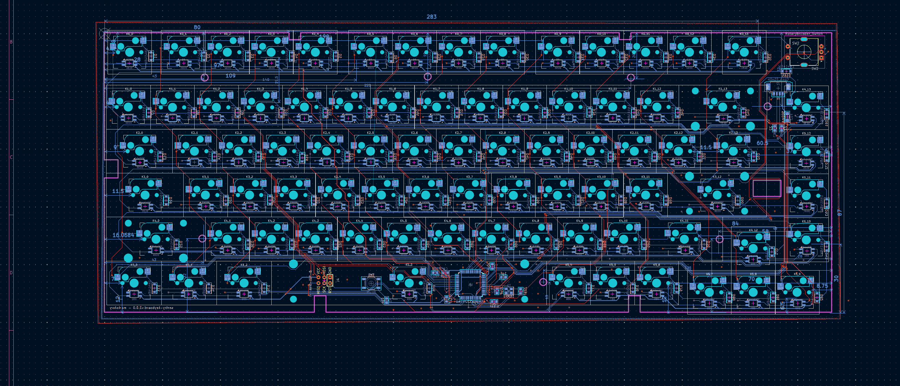

# sentry-keyboard

A reverse engineered PCB for the keyboard that Sentry gave as holiday gift in 2024.

## Features

- Per key RGB LEDs
- Rotary encoder with switch
- USB host interface connection through picoblade connector.
- Programmable keymap with QMK

## License

Both the PCB design and firmware are provided under the MIT License
